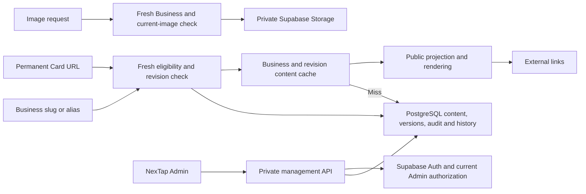

# NexTap architecture

Status: Draft. Documentation only; no implementation is authorized.

## Evidence and precedence

[vision.md](vision.md) was read in full. Numbered source references refer to its headings. Repository inspection found the vision, `assets/card_design.pdf`, `assets/nextap_logo_vector.svg` and `.atomic` orchestration files, with no application source, package manifest, migrations, deployment configuration or Card inventory workbook. The original inspection recorded no ancestor or scoped AGENTS.md, CLAUDE.md, glossary or ADR. The [setup record](../.atomic/vision-docs-setup.md) describes the original documentation ownership, not current implementation or approval evidence.

The [47-answer ledger](../.atomic/recovery/accepted-decisions.json) is authoritative for actual successful parent-chat answers through Q47. It separates the exact Q9 custom answer from the parent's interpretation and records no document approvals. The [unanswered inventory](../.atomic/recovery/unanswered-batches.json) identifies stale owner entries, not unanswered complete question batches. The [original architecture artifact](../.atomic/workflows/runs/vision-docs/7d321cbd-e1f9-4f2d-b528-0aebf2dbaac8/architecture.json), four original peer artifacts and five drafts were read as historical evidence. The continuation [source inventory](../.atomic/workflows/runs/vision-docs-continuation/5c5087c4-cc46-4444-b870-670018f926b6/sources.json) identifies the inputs; [new actual answers](../.atomic/workflows/runs/vision-docs-continuation/5c5087c4-cc46-4444-b870-670018f926b6/new-answers.json) contains no answers at this review. No continuation owner reports were available during the bounded cross-read.

The documents separate source requirements, repository facts, explicit user answers and proposals. Accepted interview decisions supersede conflicting vision passages for this release. Provider selection does not establish an account, configured project or deployed service. Artwork filenames do not establish encoded NFC/QR destinations. Peer messages and silence do not approve policy or documents.

## Accepted release boundaries

- One shared application serves all Businesses. A Business is the tenant/content boundary, not an independent installation. Source sections 6 and 27.
- The user selected Next.js with Supabase PostgreSQL, Auth and Storage, hosted on Cloudflare Workers. The exact Workers adapter is explicitly deferred until project compatibility checks. Separate staging and production Workers and Supabase services are required.
- NexTap Admin is the only authenticated launch role. There is no Business Owner dashboard, login or owner-account relationship. Admin manages Card inventory, assignments, activation, Businesses and content. This resolves section 15 versus sections 13, 32, 37 and 45.
- Printed NFC and QR destinations remain `/c/{Card ID}` permanently. The eligible Card route renders HTML directly, without redirecting to a Business slug. `/b/{slug}` is an independent sharing route. Historical slugs redirect to the same Business and remain permanently reserved. Source sections 3 to 5 and 22, clarified by user decisions.
- No product scan/click counters or Visitor events are included. Operational errors, minimized Admin audit and required Card lifecycle history are separate records. Google Reviews is an external button; automatic ratings are deferred. Payment items are external HTTPS URLs only, without payment processing, verification or copyable payment identifiers.
- There is at most one instance of each built-in Section: Hero, Contact, Social, Payments, Location, Hours, Reviews and Custom Links. Each generic Link belongs to exactly one supported link-bearing Section and appears once; repeated platform destinations require distinct labels. Contact buttons derive from authoritative phone/WhatsApp/email fields. Hours use seven days with Business timezone, closed days and multiple intervals, without holidays or computed open-now. A Business has optional logo and cover slots, rather than a gallery.

The vision excludes microservices, Kubernetes, dedicated servers, multiple databases, Redis clusters, a complex queue and a full page builder for version one, sections 38 and 41. No interview decision introduces these systems.

## Component boundaries

| Component | Responsibility | Accepted boundary |
| --- | --- | --- |
| Cloudflare Workers application | Public routes, image delivery, Admin UI and private HTTP/JSON API | One application with separate internal responsibilities; adapter deferred |
| Public eligibility service | Resolve current Card mapping/status or Business slug/alias, then check current Business eligibility and content revision | Authoritative fresh check for every new request; deny when unavailable or uncertain |
| Public page renderer | Produce only the public Business projection and registered Sections | No identity, audit, history or administrative data in public output |
| Admin management | Explicit Card commands, Business/content edits, imports and history UI | `/api/admin`, internal UUID references, current authorized Admin and MFA |
| Supabase Auth | Individual provisioned Admin accounts and authentication | Email/password with mandatory TOTP; no public signup |
| Supabase PostgreSQL | Cards, Businesses, content, slug registry, versions, audit and history | Reviewed versioned SQL migrations; expected-version conflict rejection; atomic required records and content revision |
| Supabase Storage | Sanitized logo and cover objects | Private storage; application-gated current image delivery |
| Content cache | Reuse eligible public Business representations | Keyed by Business and content revision after the fresh gate; no purge-dependent publication |
| External destinations | Contact, map, review, social and payment links | NexTap does not fetch arbitrary supplied URLs or execute financial transactions |



The diagram shows logical responsibilities, not existing source modules. Registry-based Section rendering and bounded typed settings exclude tenant-supplied HTML, scripts and executable components. Adding a supported Section type changes code and its schema; configuring an existing type changes Business content.

## State, publication and consistency

A Card belongs to at most one Business at a time; a Business can have multiple Cards. Deactivate retains assignment. Assign/reassign requires an Inactive Card, followed by a separate Activate. Unassign leaves it Inactive and unassigned. No Card deletion or token reuse is included. An assigned Card may activate while its Business is Disabled; public content remains blocked until the Business is Enabled.

Businesses start Disabled. Admin explicitly enables an initially ready page. A nonempty name and unique slug are sufficient; other content is optional. Later successful saves publish current content without a separate draft/publish workflow. Business Disable gates Card, canonical Business and alias routes without changing Card states or assignments. There is no Business hard deletion in version one.

Every new public route request checks current authoritative state before serving any cached content. Unknown or unavailable eligibility fails closed. Card redirects and fully cached HTML cannot bypass this check. Alias routing is also gated. Content already downloaded, in flight or saved by a browser cannot be recalled.

Two Admin tabs must not silently overwrite each other. Commands and edits carry the version read by the editor; the implementation must reject stale writes without mutation. A successful administrative data mutation and its minimized audit record commit atomically. Successful Card lifecycle changes also commit their required history in the same transaction. Audit/history failure rejects the mutation. A cache or image-delivery failure after commit cannot be reported as a database rollback. Database locking and exact version fields remain implementation contracts rather than an approved physical schema.

Required Card history starts on creation/import and records actual successful Assign/reassign/Activate/Deactivate/Unassign changes, actor UUID, time and prior/new Business/status. It is append-only, retained for the permanent Card lifetime, and shown in a simple read-only Admin-only per-Card timeline. Rejected attempts belong to routine audit. Card history excludes Visitor analytics, copied email/IP and content snapshots.

The accepted private API uses explicit POST lifecycle commands, PATCH for Business fields and PUT for complete Section/Link order lists. Effectful commands require `Idempotency-Key`; repeating the same key and payload returns the original result, and a different payload is rejected. Edits require `expectedVersion`. Key-retention duration and the full retry-record contract remain unfinished. Admin lists use opaque cursors, bounded limits, stable sorting and `nextCursor`. Admin errors use `{error:{code,message,fieldErrors?,requestId}}` with stable safe codes. The accepted map is 401 for missing session, 403 forbidden, 404 missing/non-disclosed resource, 409 version/lifecycle conflict, 422 semantic validation, 429 throttling and 503 unavailable dependency. Detailed public notices/statuses, pagination bounds and payload schemas belong to [FLOWS_AND_API.md](FLOWS_AND_API.md).

### Accepted revision-keyed content cache

Q47 accepted `architecture.content-cache`. Save content and increment its Business content revision atomically. Each new Card, Business or alias request reads fresh eligibility and the current revision before selecting cached public content keyed by Business and revision. On a cache miss, load current public content. A cache-write failure does not fail an otherwise valid read. Publication does not depend on successful global purge.

The loaded representation must match its revision. If an edit races a multi-part load, the implementation must obtain a coherent revision or refuse that representation; it cannot cache mixed-version data under either revision. The exact database projection, snapshot/retry mechanism, revision fields and response ordering remain implementation contracts. `expectedVersion` protects concurrent edits, while content revision identifies the cached representation. They are not assumed to be interchangeable or equal.

Cache failure falls back to current database content after successful eligibility. If authoritative eligibility or required current content is unavailable, fail closed rather than serve an old eligible page. Old revision keys may expire without being selected by a fresh current request. Cache fill is an optimization, not a durable publication job. This accepted choice preserves caching in source sections 23 to 25 without requiring a purge/retry queue. It does not set a latency target or prove runtime enforcement.

## Security and image integration

The accepted access pattern combines current Admin membership and MFA checks, identity-scoped management clients, RLS, limited grants and same-Business constraints. Anonymous management access is denied; public reads expose a restricted projection. Privileged credentials remain scoped and server-only. The API requires CSRF protection where cookie authentication applies. Exact controls are specified in [SECURITY_AND_EDGE_CASES.md](SECURITY_AND_EDGE_CASES.md).

Admin sessions have an eight-hour absolute limit and thirty-minute idle limit. Sensitive transfer, Business-enable, payment-link and Admin-permission changes require TOTP within five minutes. Bootstrap/recovery is trusted, out of band and audited. These requirements need actual provider/runtime enforcement tests; selecting Supabase does not prove the controls work.

Uploads permit JPEG, PNG and WebP only, at most 2 MiB and 16 MP. Decode, re-encode and strip metadata; reject SVG, animation and malformed images. Keep objects private. Every new delivery checks an Enabled Business and its current image reference. Disable or replacement stops old direct URLs from serving through the application. Neither reusable signed direct URLs nor a CDN response may bypass those checks. Image transformation and private delivery require Workers/adapter verification before implementation; no new image provider is selected.

Database and object storage do not share a transaction. Upload/replace/cleanup operations must retain that distinction and report committed reference state truthfully. Unused temporary objects expire after twenty-four hours. The detailed storage workflow belongs to the API and database contracts and must satisfy the fresh image gate. Post-commit cleanup failure cannot undo a committed reference or authorize an old image URL.

Safe content uses plain text, validated contact fields, HTTPS URLs without embedded credentials, registered icons and Section schemas, with bounds specified in the security document. No arbitrary supplied-URL fetching, HTML/script execution or tracking endpoint is included. Complete contact/Unicode/settings normalization and the combined JSON request-byte ceiling remain unfinished implementation bounds.

## Deployment and provider facts

Cloudflare's official [Next.js guide](https://developers.cloudflare.com/workers/framework-guides/web-apps/nextjs/) and [OpenNext guide](https://developers.cloudflare.com/workers/framework-guides/web-apps/opennext/), updated 2026-08-25, were read directly again for this reconciliation. Cloudflare recommends `vinext` for new applications on Workers and calls it beta. It lists App Router, routes, RSC, Server Actions, SSR and ISR support and requires project compatibility checks. OpenNext adapts normal `next build` output and remains a documented maintenance path; its guide says Node.js middleware is unsupported. The [Pages guide](https://developers.cloudflare.com/pages/framework-guides/nextjs/) describes Pages for static exports and recommends Workers for full-stack applications.

The user selected Workers and explicitly deferred `vinext`/OpenNext until project compatibility proof. The live [vinext compatibility dashboard](https://vinext.dev/compatibility) returned data unavailable during this review. Placeholder percentages are not evidence for NexTap. Pin and test the selected framework, adapter, dependency and Workers compatibility-date combination before implementation/deployment. Workers provides a subset of Node APIs; importing a shim does not prove its methods work. See [Node compatibility](https://developers.cloudflare.com/workers/runtime-apis/nodejs/).

The [Workers Cache API guide](https://developers.cloudflare.com/workers/runtime-apis/cache/), updated 2026-08-14, distinguishes that cache from global CDN caching. `cache.delete` acts only in the invoking data center, and `cache.put` resolves regardless of whether storage succeeded. These facts prohibit assuming a local purge establishes global freshness. They support the accepted revision-cache design above, but do not select a cache binding or prove Next.js/adapter cache ordering.

Separate staging and production Workers and Supabase projects keep identity, database, storage and secrets apart. Reviewed Supabase SQL migrations are versioned in the repository, tested before production and never replaced by undocumented dashboard-only schema edits. Actual build/release automation and adapter selection remain implementation work. No services were provisioned, commands run or deployments made in this task.

## Operational constraints and gates

Business count alone does not establish capacity. Source examples of hundreds to 20,000+ Businesses describe intended growth, not a load-test result or SLA. Request volume, authoritative lookup cost, cache hit rate, rendering, image delivery and provider quotas determine capacity. Fresh eligibility creates a database dependency even for a cache hit; strict revocation trades some outage tolerance and lookup cost for immediate decisions on new requests.

Q46 accepted `architecture.operational-targets`: defer numerical operating targets to mandatory prelaunch decisions verified against provider plans. Do not invent budget, SLA, latency, region, recovery-time or acceptable-data-loss values. This is an accepted deferral, not an unanswered interview question. Review actual account plans, quotas, costs and capabilities before making performance or recovery promises.

Required application retention is ninety days for minimized routine Admin audit, fourteen days for operational errors and twenty-four hours for raw imports/unused temporary uploads. Card history has its separate lifetime policy. Logs use request IDs, route templates and redacted errors without retained Visitor identifiers, IPs, full tokens, queries, bodies, credentials or tracking.

A mandatory provider-account review must verify native log/backup contents, retention, operator permissions, deletion/reconciliation and restore coverage. Application expiry does not establish provider deletion. Restore verification must cover both relational data and private image objects, including version/audit/history/reference consistency. Actual backup features, schedules, plan costs, regions, RPO/RTO and a restoration exercise remain unverified gates. Restored old mappings, eligibility or content must not silently reopen revoked public access before reconciliation.

No Kubernetes, microservices, Redis, independent analytics store, queue, Cloudflare D1/R2/KV/Durable Objects or payment processing is selected. Growth decisions require measured bottlenecks; host-supported bindings are not requirements.

## Domain language

**Business**: The activity or organization represented by one public NexTap page. It is the tenant. _Avoid_: account when Business is meant.

**Card**: A physical NexTap card with one permanent public identity and an optional current Business assignment. _Avoid_: profile or Business.

**Card ID**: The permanent public identifier printed or encoded on a Card. _Avoid_: internal UUID or slug. New IDs require at least 128 cryptographically random bits; legacy printed IDs remain unchanged.

**Assignment**: The current association of one Card with one Business. _Avoid_: activation when only the association is meant.

**Activation**: Making an assigned Card Active. Public access also requires an Enabled Business. _Avoid_: assignment or Business enablement.

**Section**: A supported configurable content group on a public Business page.

**Link**: A Business-controlled external destination shown in exactly one supported link-bearing Section. Contact actions derive separately from authoritative contact fields.

**Slug alias**: A former Business sharing slug permanently reserved to that same Business.

**Card history**: The minimal record of successful changes to a Card's identity/state/assignment throughout its lifetime. It is distinct from Visitor analytics and expiring routine audit.

## Inline decisions and trade-offs

Next.js with Supabase and Cloudflare Workers are accepted provider decisions. Vercel was rejected. Managed Auth/database/storage reduce initial server operations while creating provider dependence. Workers adds adapter/runtime verification; the user deferred that adapter rather than selecting vinext or OpenNext before testing. Staging and production separation increases service setup and plan cost while containing tests and migration mistakes.

Fresh authoritative eligibility and gated private images are accepted security decisions. They prevent stale caches from bypassing Disable, reassignment or replacement, at the cost of database availability and checks on each new delivery. Serving up to sixty seconds of stale eligibility and leaving sanitized images publicly accessible were rejected. Revision-keyed cached content is accepted separately under Q47; it avoids purge-dependent publication but requires atomic revision changes and coherent reads.

Operational Card history is mandatory from day one under Q9. Its exact custom answer, including the trailing space, is preserved here as a JSON string:

```json
{"answer":"1 , store the history from day one with simple ui "}
```

The ledger separately attributes this interpretation to the parent at transcript line 143: "Option 1 plus mandatory operational Card history from day one with simple UI; separate from deferred analytics." It is not substituted for the exact answer. Q28 settles successful-change coverage and the read-only Admin timeline; Q35 settles minimal append-only Card-lifetime retention. The ninety-day routine audit policy does not delete Card history.

## Deferred gates and unfinished contracts

These items are not silently resolved by documentation approval:

- `architecture.workers-adapter`: accepted pre-implementation deferral of vinext/OpenNext selection until actual project compatibility proof, including pinned framework/dependencies and Workers compatibility date. Dashboard data was unavailable; it supplies no compatibility result.
- `architecture.operational-targets`: accepted mandatory prelaunch decisions for numerical budget, SLA, latency, region, recovery time and acceptable data loss against actual plans. Capacity, quotas, costs and backup features require verification.
- `security.privacy-data-minimization.provider-review`: accepted prelaunch account review of provider-native log/backup contents, retention, permissions, deletion, reconciliation and restore coverage for relational data and private images.
- `architecture.runtime-enforcement`: verify actual session absolute/idle limits, fresh TOTP/current membership, CSRF, identity-scoped access, grants/RLS, restricted public projection, same-Business constraints and trusted-proxy/rate controls.
- `architecture.public-cache-ordering`: define and verify Next.js/adapter/HTTP/CDN cache ordering so fresh eligibility/revision and current-image checks precede every new delivery. Include aliases, conditional responses, cache misses/failures and racing saves. No response-cache shortcut may bypass the gates.
- `architecture.image-storage-workflow`: finish private transformation/delivery, replacement/removal, reference commits and cleanup execution/retry contracts. Database/object storage are non-atomic; unused temporary objects expire in 24 hours and failed cleanup cannot delete current objects or reopen old URLs.
- `database.publication-revision`: finish physical revision fields, which public-content mutations advance them, coherent restricted projection/loading and mapping, if any, to expected edit versions. Atomic content-plus-revision is already accepted; equality of the two version concepts is not.
- `api.mutation-publication`: finish committed-result/revision response schemas and timeout reconciliation without inventing a purge-dependent delivery delay, a new publish step or rollback after commit.
- `api.retry-record-contract`: define idempotency-key scope, retention, atomic retry records, replay authorization and post-expiry behavior. Keys plus versions and same-payload original-result replay are already accepted.
- `api.representation-contract`: finish public lifecycle/alias HTTP statuses and notices, slug grammar/normalization, pagination bounds, payload/field-error schemas, CSV parsing/preview binding and upload completion contracts. Preserve the safe Inactive notice and accepted Admin status map.
- `database.physical-schema`: finish schema/constraints, public-token encoding/grammar, activation timestamp meaning, ordered-content/settings and image-reference representation. Internal UUIDs, immutable legacy tokens, Section/Link cardinality and weekly-hours policy are already settled.
- `security.content-schema-details`: finish combined JSON-byte bounds, exact character counting, contact normalization and registered Section/icon settings schemas within accepted limits.
- `database.legacy-inventory`: factual legacy printed-token compatibility cannot be checked without the missing inventory sample; exact tokens must not be regenerated or normalized to fit a new encoding.

No new prerequisite-ready architecture policy question is identified. Operating numbers remain a later accepted prelaunch gate. These contracts and verification gates do not authorize implementation.

## Bounded peer review

One cross-read checked scope, vocabulary, cardinality, lifecycle, API, persistence, security and cache contracts across all five documents and the available original reports. `document_hashes` returned the same four peer hashes immediately before and after those reads. The following are the exact checked snapshots, not certification of later owner edits:

- [PRODUCT_SPEC.md](PRODUCT_SPEC.md), SHA-256 `79656d86d686b014436461928c6122a5bbe7b0844a0d2d74e5730f61bbd8eb7a`. Incomplete. Scope, lifecycle and content cardinality align, but the checked draft still calls independent activation and Card-lifetime history unsettled. Q32/Q35 settle them; Q46/Q47 also govern operating/cache wording. One consolidated reconciliation note was sent. The received product note is evidence exchange, not approval; no repaired candidate hash was checked.
- [DATABASE.md](DATABASE.md), SHA-256 `904ecbb0c3633b1dcb8ef97ba55b5ada0384f92d52e51aae94923bacc3ed32b5`. Incomplete. Cardinality, UUID/public-token separation and safe imports align, but the checked draft marks accepted history, concurrency, activation, Link membership, security bounds and content revision policies pending. The ledger settles those policies, not physical schema/timestamps. One consolidated note was sent. The received database note confirms the same cache distinction, not completion of its repair; no repaired candidate hash was checked.
- [FLOWS_AND_API.md](FLOWS_AND_API.md), SHA-256 `23d970e19053fb8a92a7b7507af10f7a319e03fcb219a016eb18072a486b0f44`. Incomplete. Direct Card HTML, public/image gates and lifecycle transactions align. Q42 to Q45 remain stale pending claims, and the proposed `delivery.state` needs reconciliation with Q47 rather than an invented delivery delay. One consolidated note was queued to the discovered pending owner stage. No reply or repaired candidate hash was checked; transport acceptance is not consent.
- [SECURITY_AND_EDGE_CASES.md](SECURITY_AND_EDGE_CASES.md), SHA-256 `456608dcc3d03e4dda5e6483051249367c9e1ca00d9375fd7691777831e641bf`. Incomplete. Fresh eligibility/private-image gates, sessions/RLS, minimized retention and atomic audit/history align. The checked draft still describes architecture/API owner answers as unsettled where Q42 to Q47 now apply. One consolidated note was queued to the discovered pending owner stage. No reply or repaired candidate hash was checked; enforcement/provider-review/normalization gates remain genuine.

Missing replies, stale snapshots and unreviewed later candidates remain incomplete checks, not consent. No parent target was visible in the Intercom list; this document and its report carry the durable handoff. The root must append its plain peer-check record before freezing approval hashes. The candidate stays Draft. A scoped approval must name the exact precomputed replacement of `Status: Draft. Documentation only; no implementation is authorized.` with `Status: Approved. Documentation only; no implementation is authorized.` No material postapproval rewrite is permitted.

## Amendments

The user requires all questions and scoped approvals in the parent chat. Actual ledger/root human-answer evidence governs decisions; ordinary peer messages and silence do not. Only this document and the continuation round-zero `architecture.json` report are owned here.

Reconciliation applies Q42 to Q47 alongside the previously recorded answers. Day-one operational Card history, Admin-only launch, deferred analytics, Workers adapter deferral, separate environments, fresh public/image gates and atomic audit remain intact. Numerical targets are explicitly deferred to prelaunch; revision-keyed content caching is accepted. Neither choice is reopened under a new alias.

## Companion documents

[PRODUCT_SPEC.md](PRODUCT_SPEC.md) owns scope, terms and business rules. [DATABASE.md](DATABASE.md) owns persistence and migrations. [FLOWS_AND_API.md](FLOWS_AND_API.md) owns routes and operation contracts. [SECURITY_AND_EDGE_CASES.md](SECURITY_AND_EDGE_CASES.md) owns security, exposure and retention policy.

## Recovery peer-check record

- docs/PRODUCT_SPEC.md: incomplete; incomplete, checked hash is stale. Full before/after-stable snapshot checked for scope, vocabulary, cardinality, lifecycle, API/persistence/security/cache dependencies. Admin-only, one Business/Card mapping, aliases, Sections/Links/hours/contact/payments align. Lines 53/83/167/177-180 retain stale activation/history/operating policy claims now settled by ledger Q32/Q35/Q46/Q47. One consolidated evidence note sent; received product acknowledgment is not policy/document consent. Repair/current candidate hash not checked.
- docs/DATABASE.md: incomplete; incomplete, checked hash is stale. Full before/after-stable snapshot checked across requested contracts. Cardinality, internal UUID/public token distinction, tenant children and atomic safe import align. Lines 95/101-107/119-125/137-139/157-163 mark accepted history, concurrency, independent activation, Link membership, security bounds and revision cache pending. Ledger settles policy, not physical fields/timestamps. Consolidated note sent; received database note correctly distinguishes expectedVersion from content revision and non-atomic DB/Storage. Repair/current candidate hash not checked.
- docs/FLOWS_AND_API.md: incomplete; incomplete, checked hash is stale. Full before/after-stable snapshot checked across requested contracts. Direct Card HTML, public/alias/image gates, lifecycle, expected versions and atomic audit/history align. Lines 145/200/236/277/281-290 still call Q42-Q45 pending; speculative delivery.state requires Q47 reconciliation, not a purge-delay assumption. Key retention/public statuses/payload/import/image details remain genuine implementation contracts. One consolidated note queued to discovered pending owner stage; no reply/current repaired candidate checked, and transport is not consent.
- docs/SECURITY_AND_EDGE_CASES.md: incomplete; incomplete, checked hash is stale. Full before/after-stable snapshot checked across requested contracts. Fresh fail-closed eligibility, private current-reference images, mandatory MFA/sessions/RLS, minimized retention and atomic audit/history align. Lines 185-186 describe owner answers as unsettled where Q42-Q47 apply. Enforcement/provider-native log-backup/restore/normalization gates stay open. One consolidated note queued to discovered pending owner stage; no reply/current repaired candidate checked, and transport is not consent.
