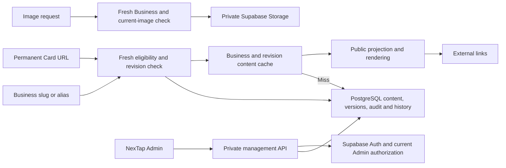

# NexTap architecture

Status: Approved. Documentation only; no implementation is authorized.

## Evidence and precedence

The complete [vision.md](vision.md), all five specification drafts and the [47-answer ledger](../.atomic/recovery/accepted-decisions.json) were read for this pass. Numbered source references refer to vision headings. The ledger is authoritative for successful parent-chat answers through Q47 and records no document approvals. It overrides stale unresolved wording in historical owner artifacts. Peer messages and silence do not approve policy or documents.

A current visible-file inventory found the five drafts and vision; historical inspection recorded design assets and Atomic documentation records but no application source, package manifest, migrations, deployment configuration or Card inventory workbook. No runtime, provider account or artwork payload was tested in this pass. Historical inspection recorded no glossary or ADR; that ancestor search was not repeated here.

Accepted choices below are binding decision evidence. Sections explicitly labelled recommended contracts finish technical details for documentation review, not as new user answers or existing implementation. Provider selection does not establish configured services. Documentation remains Draft and does not authorize implementation, publication or deployment.

## Accepted release boundaries

- One shared application serves all Businesses. A Business is the tenant/content boundary, not an independent installation. Source sections 6 and 27.
- The user selected Next.js with Supabase PostgreSQL, Auth and Storage, hosted on Cloudflare Workers. The exact Workers adapter is explicitly deferred until project compatibility checks. Separate staging and production Workers and Supabase services are required.
- NexTap Admin is the only authenticated launch role. There is no Business Owner dashboard, login or owner-account relationship. Admin manages Card inventory, assignments, activation, Businesses and content. This resolves section 15 versus sections 13, 32, 37 and 45.
- Printed NFC and QR destinations remain `/c/{Card ID}` permanently. The eligible Card route renders HTML directly, without redirecting to a Business slug. `/b/{slug}` is an independent sharing route. Historical slugs redirect to the same Business and remain permanently reserved. Source sections 3 to 5 and 22, clarified by user decisions.
- No product scan/click counters or Visitor events are included. Operational errors, minimized Admin audit and required Card lifecycle history are separate records. Google Reviews is an external button; automatic ratings are deferred. Payment items are external HTTPS URLs only, without payment processing, verification or copyable payment identifiers.
- There is at most one instance of each built-in Section: Hero, Contact, Social, Payments, Location, Hours, Reviews and Custom Links. Each generic Link belongs to exactly one supported link-bearing Section and appears once; repeated platform destinations require distinct labels. Contact buttons derive from authoritative phone/WhatsApp/email fields. Hours use seven days with Business timezone, closed days and multiple intervals, without holidays or computed open-now. A Business has optional logo and cover slots, rather than a gallery.

The vision excludes microservices, Kubernetes, dedicated servers, multiple databases, Redis clusters, a complex queue and a full page builder for version one, sections 38 and 41. No interview decision introduces these systems.

## Component boundaries

| Component | Responsibility | Accepted boundary |
| --- | --- | --- |
| Cloudflare Workers application | Public routes, image delivery, Admin UI and private HTTP/JSON API | One application with separate internal responsibilities; adapter deferred |
| Public eligibility service | Resolve current Card mapping/status or Business slug/alias, then check current Business eligibility and content revision | Authoritative fresh check for every new request; deny when unavailable or uncertain |
| Public page renderer | Produce only the public Business projection and registered Sections | No identity, audit, history or administrative data in public output |
| Admin management | Explicit Card commands, Business/content edits, imports and history UI | `/api/admin`, internal UUID references, current authorized Admin and MFA |
| Supabase Auth | Individual provisioned Admin accounts and authentication | Email/password with mandatory TOTP; no public signup |
| Supabase PostgreSQL | Cards, Businesses, content, slug registry, versions, audit and history | Reviewed versioned SQL migrations; expected-version conflict rejection; atomic required records and content revision |
| Supabase Storage | Sanitized logo and cover objects | Private storage; application-gated current image delivery |
| Content cache | Reuse eligible public Business representations | Keyed by Business and content revision after the fresh gate; no purge-dependent publication |
| External destinations | Contact, map, review, social and payment links | NexTap does not fetch arbitrary supplied URLs or execute financial transactions |

Recommended internal boundaries: route handlers parse HTTP and select responses; authorization verifies current identity; management services enforce commands; restricted database functions provide coherent public gates/projections; the renderer accepts only the public projection; storage code owns sanitized immutable bytes; maintenance code expires temporary data and deletes unreferenced objects. Keep these as modules in the one application, not separately deployed services. Only management/database transaction code changes current references, versions, audit or history. Renderer/cache code never authorizes access or writes tenant data.



The diagram shows logical responsibilities, not existing source modules. Registry-based Section rendering and bounded typed settings exclude tenant-supplied HTML, scripts and executable components. Adding a supported Section type changes code and its schema; configuring an existing type changes Business content.

## State, publication and consistency

A Card belongs to at most one Business at a time; a Business can have multiple Cards. Deactivate retains assignment. Assign/reassign requires an Inactive Card, followed by a separate Activate. Unassign leaves it Inactive and unassigned. No Card deletion or token reuse is included. An assigned Card may activate while its Business is Disabled; public content remains blocked until the Business is Enabled.

Businesses start Disabled. Admin explicitly enables an initially ready page. A nonempty name and unique slug are sufficient; other content is optional. Later successful saves publish current content without a separate draft/publish workflow. Business Disable gates Card, canonical Business and alias routes without changing Card states or assignments. There is no Business hard deletion in version one.

Every new public route request checks current authoritative state before serving any cached content. Unknown or unavailable eligibility fails closed. Card redirects and fully cached HTML cannot bypass this check. Alias routing is also gated. Content already downloaded, in flight or saved by a browser cannot be recalled.

Two Admin tabs must not silently overwrite each other. Commands and edits carry the version read by the editor; stale writes make no changes. A successful administrative data mutation and its minimized audit record commit atomically. Successful Card lifecycle changes also commit required history in that transaction. Audit/history failure rejects the mutation. A cache or image-delivery failure after commit cannot be reported as a database rollback. Recommended transaction mechanics: serialize writes on the Card or parent Business row, compare the expected version under that lock, and persist the updated state and original retry result before commit. Child-content writes lock their parent Business to prevent mixed revisions and concurrent cardinality violations. Physical fields and grants belong to [DATABASE.md](DATABASE.md).

Required Card history starts on creation/import and records actual successful Assign/reassign/Activate/Deactivate/Unassign changes, actor UUID, time and prior/new Business/status. It is append-only, retained for the permanent Card lifetime, and shown in a simple read-only Admin-only per-Card timeline. Rejected attempts belong to routine audit. Card history excludes Visitor analytics, copied email/IP and content snapshots.

Q42 to Q45 accept explicit POST lifecycle commands, PATCH Business fields, PUT complete Section/Link order lists, idempotency keys plus expected versions, standard HTTP statuses and cursor pagination. These are not pending choices. Effectful commands require `Idempotency-Key`; repeating the same key and payload returns the original result, and a different payload is rejected. Current authorization still applies to replay. Detailed key scope/retention, payloads, safe notices, statuses and pagination bounds belong to [FLOWS_AND_API.md](FLOWS_AND_API.md). Architecture requires the retry result and mutation to commit together, so a lost HTTP response never requires rerunning a committed change. A post-commit cache failure does not introduce a pending publication state.

### Accepted revision-keyed content cache

Q47 accepted `architecture.content-cache`. Save content and increment its Business content revision atomically. Each new Card, Business or alias request reads fresh eligibility and the current revision before selecting cached public content keyed by Business and revision. On a cache miss, load current public content. A cache-write failure does not fail an otherwise valid read. Publication does not depend on successful global purge.

Recommended revision contract: keep edit version and public content revision as distinct persisted concepts. Successful Business field, slug, Section, Link, order, hours/contact/location or image-reference changes advance the parent edit version; changes affecting the public representation also advance its content revision in the same transaction as audit. Card lifecycle changes advance the Card version but do not change shared Business content. Enable/Disable changes eligibility and edit version; a representation revision need not change solely for eligibility. These rules are proposed physical mechanics for the accepted Q31/Q47 policies, not a claim that the counters are equal.

Recommended coherent read contract: a restricted database function resolves Card or slug and returns current eligibility, Business identity and revision from one database statement snapshot. On a cache miss, a second restricted function loads the complete public projection and its revision from one statement snapshot. It also rechecks the originating Card mapping or slug and Business eligibility. If its identity/revision differs from the first read, select the new tuple and its coherent projection, never store it under the old key. If a canonical slug became an alias, return its gated redirect instead of rendering it as canonical. Denial or dependency failure returns no Business content. This avoids mixed reads without an unbounded retry loop. Requests authorized before a concurrent commit remain in-flight copies; a request beginning after that commit must see authoritative current state.

Cache failure falls back to current database content after successful eligibility. If authoritative eligibility or required current content is unavailable, fail closed rather than serve an old eligible page. Old revision keys may expire without being selected by a fresh current request. Cache fill is an optimization, not a durable publication job. This accepted choice preserves caching in source sections 23 to 25 without requiring a purge/retry queue. It does not set a latency target or prove runtime enforcement.

### Recommended public request sequence

1. Cloudflare volumetric controls admit the request. Route parsing preserves printed Card tokens; token compatibility requires the actual legacy sample. Neither CDN nor framework full-page caching answers this route first.
2. The application invokes the fresh restricted database gate, without replica lag, cached authorization, framework data-cache reuse or stale fallback. `/c/{Card ID}` checks Card status/current assignment plus Business Enabled state. `/b/{slug}` checks the reserved registry plus Business Enabled state.
3. A denied request produces only the safe lifecycle notice. An unavailable gate produces the safe unavailable response. Neither reads previously eligible page content. A historical alias produces its gated redirect only after this check; the redirect target performs a separate check.
4. Eligible canonical/Card requests select internal public-projection cache by environment, renderer/schema version, Business UUID and content revision. Cache hit content must match that exact tuple. Do not cache Card mappings, eligibility or alias authorization in that entry.
5. On a miss or cache-read failure, use the coherent restricted projection described above. Render directly at the Card URL or canonical Business URL. Store only the public projection; exclude identities, inventory, audit/history, private paths and hidden content. Cache-fill failure is a redacted operational error, not failure of a valid page read.
6. Evaluate any conditional response only after fresh authorization and current revision selection. A stale ETag must never produce a 304 for a now-ineligible route. Recommended HTTP default is `Cache-Control: private, no-store` on public HTML, aliases, notices and gated images, plus Admin/session responses; internal content/object caching remains available behind the gate. Exact public status and header examples belong to the API document.

Framework static generation, ISR, route caches, automatic prefetch/navigation caches, CDN cache rules and image optimizers must not become an ungated alternate delivery path. Rendered or browser-retained copies are not revocable; new network requests are. Include renderer/schema version in cache keys so a release cannot reinterpret old cached projections using a new schema.

### Recommended Admin mutation sequence

1. Verify Supabase session/project, server absolute/idle expiry, current membership, MFA, CSRF where applicable, operation limit and fresh TOTP for the accepted sensitive actions.
2. Validate the request and same-Business child relationships. Bind the retry key to authenticated actor, operation/resource and canonical request payload; do not accept client actor or audit fields.
3. Within one database transaction, serialize the retry key, replay an already committed matching result if authorized, or lock the target row and enforce expected version/lifecycle. Write state, versions/revision, required audit/history and original result atomically.
4. Return committed state and applicable version/revision. No global purge or render job is required for publication. After timeout, the UI retries the same key/payload within its documented retention contract; after expiry it rereads before deciding on a new operation. It must not blindly resubmit with a new key.
5. Cache fill and object cleanup happen outside the mutation transaction. Their failure is separately observable and never changes the recorded commit result.

## Security and image integration

The accepted access pattern combines current Admin membership and MFA checks, identity-scoped management clients, RLS, limited grants and same-Business constraints. Anonymous management access is denied; public reads expose a restricted projection. Privileged credentials remain scoped and server-only. The API requires CSRF protection where cookie authentication applies. Exact controls are specified in [SECURITY_AND_EDGE_CASES.md](SECURITY_AND_EDGE_CASES.md).

Admin sessions have an eight-hour absolute limit and thirty-minute idle limit. Sensitive transfer, Business-enable, payment-link and Admin-permission changes require TOTP within five minutes. Bootstrap/recovery is trusted, out of band and audited. These requirements need actual provider/runtime enforcement tests; selecting Supabase does not prove the controls work.

Uploads permit JPEG, PNG and WebP only, at most 2 MiB and 16 MP. Decode, re-encode and strip metadata; reject SVG, animation and malformed images. Keep objects private. Every new public delivery checks an Enabled Business and its current image reference. Disable or replacement stops old direct URLs from serving. Neither reusable signed direct URLs nor a CDN response may bypass those checks. Decoder CPU/memory limits, transformation and private delivery require Workers/adapter verification before implementation; no new image provider is selected.

### Recommended private image workflow

1. Authorize Admin, target Business, Logo/Cover role and upload limit. Accept bounded bytes through the management application, not a public Storage URL. Generate a server-owned immutable object identity; reject client paths or cross-Business image identifiers.
2. Validate/decode/re-encode before making an object current. Register an upload intent with actor, Business, role, server-owned object identity, checksum and expiry before writing sanitized bytes to its private immutable object. A crash after storage therefore leaves a discoverable intent, not an untracked orphan. Raw input is temporary and never public. Confirm successful object storage before reference commit; an uncertain upload result is reconciled by the server-owned identity, not by guessing a new public reference.
3. At completion reauthorize and lock the intent and parent Business. Check intent binding, unused/unexpired state, expected Business version and stored sanitized object. In one database transaction switch the current reference, advance edit version/content revision, write minimized audit, consume the intent and persist retry result. Also record the former object as a cleanup candidate. The previous reference remains current if this transaction fails.
4. After commit the new reference is authoritative. The old public URL fails its current-reference gate immediately, whether or not deletion succeeded. Clearing an optional image slot uses the same transaction without a new object. Never remove the new object to imitate rollback after a response or cleanup failure.
5. Recommended public image locator contains an opaque image identity, not the private path. Fresh restricted lookup must prove that identity is the current Logo/Cover of an Enabled Business before bytes, HEAD or conditional responses are served. Cache immutable sanitized bytes internally by environment and object identity only behind that lookup. Storage bucket/API permissions deny direct anonymous reads; do not expose reusable signed Storage URLs. Disabled-page Admin previews use separately authorized management delivery and no shared response cache.
6. Recommended cleanup uses database upload-intent/cleanup records and a bounded scheduled maintenance invocation in the same application, not a new queue service. It retries idempotent deletion and expires raw imports/unused uploads within the accepted 24-hour period. Replaced/removed objects become eligible for cleanup immediately after commit; no public retention grace is introduced. Lock and mark an expired intent ineligible for completion before deleting its object, so cleanup and completion cannot both succeed. Before deletion prove no current reference uses the immutable identity. References can only consume unused intents, never reattach cleanup candidates, preventing a deletion/reference race. Missing objects are successful deletion results; provider errors remain retryable records with redacted alerts.

Crash reconciliation scans expired intents and cleanup candidates: stored-but-uncommitted objects are unused, committed objects remain protected by current references, and a lost deletion response can safely repeat deletion. No age-only bucket sweep may delete current images. Maintenance availability and actual deletion/retention behavior are provider verification gates; 24 hours is an accepted requirement, not demonstrated scheduling performance.

Safe content uses plain text, validated contact fields, HTTPS URLs without embedded credentials, registered icons and Section schemas, with accepted bounds in the security document. No arbitrary supplied-URL fetching, HTML/script execution or tracking endpoint is included. Exact normalization/settings schemas belong to the Database/Security contracts.

## Deployment and provider facts

Historical Architecture review cited Cloudflare's official [Next.js guide](https://developers.cloudflare.com/workers/framework-guides/web-apps/nextjs/), [OpenNext guide](https://developers.cloudflare.com/workers/framework-guides/web-apps/opennext/), [Pages guide](https://developers.cloudflare.com/pages/framework-guides/nextjs/), [Node compatibility guide](https://developers.cloudflare.com/workers/runtime-apis/nodejs/) and [Cache API guide](https://developers.cloudflare.com/workers/runtime-apis/cache/). It reported vinext beta and an OpenNext maintenance path, unavailable live compatibility-dashboard data, partial Node API support and local rather than global Cache API deletion. Those historical observations were not freshly fetched or runtime-tested in this pass; reverify version-specific facts before adapter selection.

Workers is accepted, but vinext/OpenNext selection is not. Pin and test the actual framework, adapter, dependencies and Workers compatibility-date combination. Importing a Node shim, checking a generic compatibility percentage or obtaining a successful build does not prove fresh authorization, SSR, private storage or image decoding. Publication must not depend on local deletion or assumed successful `cache.put`; revision selection is the accepted correctness mechanism.

Separate staging and production Workers and Supabase projects are accepted. Recommended isolation includes separate domains, Auth issuers, databases, private buckets, secrets, cache namespaces, maintenance state, rate counters and retry records. Production credentials never enter staging/browser/build output. Each Worker rejects wrong-project sessions and uses only its environment's services. Staging uses synthetic inventory/content and separately provisioned Admins; no production data/Auth/object clone is implied. Production QR/NFC destinations remain `nextap.services`; test Cards use staging destinations without modifying printed production tokens.

### Recommended migration promotion

1. Keep reviewed SQL migrations and the matching application/schema compatibility description together. Prohibit undocumented production dashboard-only schema changes. Check that migrations preserve permanent tokens, reserved aliases, tenant constraints and lifetime Card history.
2. Rehearse against a disposable/staging database at the production schema version using synthetic data. Test migration ordering, constraints, grants/RLS, public projections, retry/audit/history atomicity and coherent revision reads, including image references. Record the tested migration identifiers and pinned application/runtime combination.
3. Before production promotion, verify the account's actual backup/object recovery coverage and a usable restore procedure. Evaluate lock duration, data transformation and whether old/new application versions can coexist. These checks require operating targets once set; no backup schedule or permitted downtime is invented here.
4. Prefer additive, backward-compatible schema expansion before application changes. Promote the same reviewed migration content, not staging records or credentials. Deploy the compatible application only after schema checks pass. Destructive contraction is a separate reviewed migration after old code no longer needs it and required retention/reference invariants are proven.
5. If safe coexistence cannot be shown, hold Admin writes and public delivery through an application maintenance gate before changing incompatible schema. Smoke-check authentication, permissions, resolver/revision ordering, image access and required records before reopening. Failed checks keep the hold active.
6. Do not assume application rollback reverses database migrations or committed data. Roll back application code only when schema-compatible; otherwise use a reviewed forward fix or the tested restore process. An uncertain migration is inspected before rerun, not blindly replayed.

No build, provider provisioning, migration or deployment was performed in this documentation task.

## Operational constraints and gates

Business count alone does not establish capacity. Source examples of hundreds to 20,000+ Businesses describe intended growth, not a load-test result or SLA. Request volume, authoritative lookup cost, cache hit rate, rendering, image delivery and provider quotas determine capacity. Fresh eligibility creates a database dependency even for a cache hit; strict revocation trades some outage tolerance and lookup cost for immediate decisions on new requests.

Q46 accepted `architecture.operational-targets`: defer numerical operating targets to mandatory prelaunch decisions verified against provider plans. Do not invent budget, SLA, latency, region, recovery-time or acceptable-data-loss values. This is an accepted deferral, not an unanswered interview question. Review actual account plans, quotas, costs and capabilities before making performance or recovery promises.

Required application retention is ninety days for minimized routine Admin audit, fourteen days for operational errors and twenty-four hours for raw imports/unused temporary uploads. Card history has its separate lifetime policy. Logs use request IDs, route templates and redacted errors without retained Visitor identifiers, IPs, full tokens, queries, bodies, credentials or tracking.

A mandatory provider-account review must verify native log/backup contents, retention, operator permissions, deletion/reconciliation and restore coverage. Application expiry does not establish provider deletion. Restore verification must cover both relational data and private image objects, including version/audit/history/reference consistency. Actual backup features, schedules, plan costs, regions, RPO/RTO and a restoration exercise remain unverified gates. Restored old mappings, eligibility or content must not silently reopen revoked public access before reconciliation.

### Recommended restore and reconciliation

1. A trusted operator activates a public and management-write hold outside restored Business/Card state. Recovery mode denies pages, aliases and images even if a restored record says Enabled. Keep that hold independent of the database snapshot so restore cannot switch it off accidentally.
2. Restore to an isolated recovery service first, using verified relational, Auth/configuration and private-object coverage. Record the actual recovery point and missing coverage. Do not presume PostgreSQL backup includes Storage bytes or Auth settings, or that database and bucket snapshots have the same time.
3. Validate migrations/grants/RLS, actor references, same-Business constraints, Card status/assignment, lifetime history, slug reservations, edit versions/content revisions, audit and committed retry records. Restore must not make a completed key rerun unknowingly. If replay records cannot be recovered, keep affected writes held until their outcomes are reconciled.
4. Compare recovery state with trustworthy post-recovery-point change evidence and the current operator incident record. Reconcile Disable, deactivation/transfer/unassignment, removed contacts/Links, payment changes, slug reservations, image replacement/removal and Admin revocation. A snapshot or expired routine audit alone cannot prove that no later revocation occurred. If evidence is incomplete, keep affected routes/operations closed; do not infer Enabled/Active state from an old backup. Do not fabricate lost history; record actual loss and resolve it before reopening affected operations.
5. Resolve each current image reference to verified sanitized private bytes. Missing/current mismatches deny image delivery until repaired through an authorized reference change. Identify orphans separately; do not promote unreferenced objects back into current slots. Reconcile expired temporary data and accepted retention before making restored data accessible.
6. Invalidate preincident sessions or otherwise prove current membership/session policy before management reopening. Switch to a fresh environment/recovery cache namespace so reused revision numbers cannot select pre-restore content. Recompute projections only from reconciled state; cache purge is not the safety mechanism.
7. Run allow/deny and concurrent-read checks on recovery state, including old Card assignment, disabled aliases, old image IDs, missing objects, stale keys and unauthorized direct provider paths. Record operator signoff and actual recovery/data-loss results against the later approved operating targets, then deliberately release the external hold. If an account cannot support this procedure, launch remains gated.

This is a recommended recovery procedure, not a claim of a tested restore or guaranteed recovery time. Lifetime history and post-snapshot revocations require adequate recoverable evidence; the provider/account review must demonstrate that coverage rather than silently weaken the accepted policies.

No Kubernetes, microservices, Redis, independent analytics store, queue, Cloudflare D1/R2/KV/Durable Objects or payment processing is selected. Growth decisions require measured bottlenecks; host-supported bindings are not requirements.

## Domain language

**Business**: The activity or organization represented by one public NexTap page. It is the tenant. _Avoid_: account when Business is meant.

**Card**: A physical NexTap card with one permanent public identity and an optional current Business assignment. _Avoid_: profile or Business.

**Card ID**: The permanent public identifier printed or encoded on a Card. _Avoid_: internal UUID or slug. New IDs require at least 128 cryptographically random bits; legacy printed IDs remain unchanged.

**Assignment**: The current association of one Card with one Business. _Avoid_: activation when only the association is meant.

**Activation**: Making an assigned Card Active. Public access also requires an Enabled Business. _Avoid_: assignment or Business enablement.

**Section**: A supported configurable content group on a public Business page.

**Link**: A Business-controlled external destination shown in exactly one supported link-bearing Section. Contact actions derive separately from authoritative contact fields.

**Slug alias**: A former Business sharing slug permanently reserved to that same Business.

**Card history**: The minimal record of successful changes to a Card's identity/state/assignment throughout its lifetime. It is distinct from Visitor analytics and expiring routine audit.

## Inline decisions and trade-offs

Next.js with Supabase and Cloudflare Workers are accepted provider decisions. Vercel was rejected. Managed Auth/database/storage reduce initial server operations while creating provider dependence. Workers adds adapter/runtime verification; the user deferred that adapter rather than selecting vinext or OpenNext before testing. Staging and production separation increases service setup and plan cost while containing tests and migration mistakes.

Fresh authoritative eligibility and gated private images are accepted security decisions. They prevent stale caches from bypassing Disable, reassignment or replacement, at the cost of database availability and checks on each new delivery. Serving up to sixty seconds of stale eligibility and leaving sanitized images publicly accessible were rejected. Revision-keyed cached content is accepted separately under Q47; it avoids purge-dependent publication but requires atomic revision changes and coherent reads.

Operational Card history is mandatory from day one under Q9. Its exact custom answer, including the trailing space, is preserved here as a JSON string:

```json
{"answer":"1 , store the history from day one with simple ui "}
```

The ledger separately attributes this interpretation to the parent at transcript line 143: "Option 1 plus mandatory operational Card history from day one with simple UI; separate from deferred analytics." It is not substituted for the exact answer. Q28 settles successful-change coverage and the read-only Admin timeline; Q35 settles minimal append-only Card-lifetime retention. The ninety-day routine audit policy does not delete Card history.

## Required compatibility and launch gates

The architecture-owned technical procedures above are recommended documentation contracts. Their feasibility remains unverified. Q42 to Q45 are accepted API policies; Q46 is an accepted deferral of numerical targets; Q47 is the accepted revision-cache policy. None is reopened as an unanswered question.

| Gate | Required evidence before proceeding |
| --- | --- |
| Cloudflare adapter compatibility, before implementation | Test the pinned Next.js framework, selected vinext/OpenNext adapter, dependencies and Workers runtime. Evidence includes SSR/route/HTTP semantics, database transaction/projection access, private Storage and bounded image decoding, fresh eligibility/revision/current-image ordering, cache hit/miss/failure behavior, identity/MFA/session/CSRF/RLS/rate enforcement, and scheduled maintenance feasibility. No adapter is selected by this draft. |
| Legacy inventory compatibility | Obtain the actual printed/encoded token sample before legacy parsing/import/public use; verify exact case, characters and URL handling without normalization/regeneration. Vision examples and asset names are not evidence. |
| Provider logs, backup, migration and restore review, before launch | Verify Cloudflare/Supabase native logs, Auth/Storage metadata, backups, contents, retention/deletion, operator access, migration promotion, relational/private-object coverage and restore reconciliation. Missing post-snapshot revocations, history, retry records or current references keep affected delivery closed. |
| Operating targets, before launch | Q46 requires provider-verified budget, SLA, latency, region, recovery time and acceptable data loss. Agree actual load assumptions and test authoritative lookup cost, cache behavior, image processing/delivery and maintenance against account quotas/costs. No numbers are selected here. |

Detailed physical tables/constraints and token encoding belong to [DATABASE.md](DATABASE.md); request schemas, retry retention, statuses, CSV preview binding and pagination belong to [FLOWS_AND_API.md](FLOWS_AND_API.md); exact normalization, settings and validation bounds belong to [SECURITY_AND_EDGE_CASES.md](SECURITY_AND_EDGE_CASES.md). These companion contracts must implement the sequences above without changing accepted policy. Their current completion is not certified by this owner.

## Documentation review boundary

This pass read all five drafts and the ledger for scope, terminology, lifecycle, API, persistence, security and cache alignment. Their checked policies align with Q1 to Q47; retained historical hash/check tables describe older revisions, not present approval. Parallel owner edits can change companion detail after these reads, so final cross-document review remains the parent owner's responsibility. No runtime tests, provider compatibility tests or final frozen approval hashes were produced here.

This owner changed only Architecture. Intercom exchanges communicate findings and candidate contracts, not human consent. All human approvals belong in the parent chat. The candidate remains Draft; documentation approval must not be represented as implementation or deployment permission. The ledger's null document approvals remain the approval evidence until the parent records an actual scoped approval.

## Companion documents

[PRODUCT_SPEC.md](PRODUCT_SPEC.md) owns scope, terms and business rules. [DATABASE.md](DATABASE.md) owns persistence and migrations. [FLOWS_AND_API.md](FLOWS_AND_API.md) owns routes and operation contracts. [SECURITY_AND_EDGE_CASES.md](SECURITY_AND_EDGE_CASES.md) owns security, exposure and retention policy.
